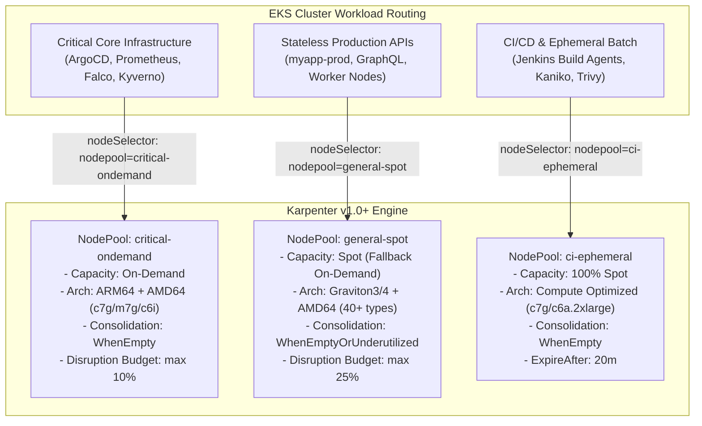
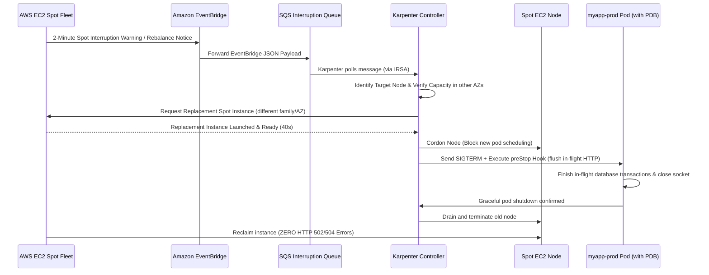

# Project 6: Cloud FinOps & Dynamic Intelligent Autoscaling

> **Project 6** | Enterprise EKS Cost Optimization, Karpenter v1.0+, Event-Driven Elasticity, & Unit Cost Governance
> Stack: Karpenter v1.0+ · AWS EC2 Spot & Graviton3/4 · KEDA v2.14+ · OpenCost / Kubecost · EventBridge Interruption Queue · Prometheus FinOps Rules

---

## 1. Executive Summary & Business Case

Running production Kubernetes on static Node Groups or standard Cluster Autoscaler (CAS) creates massive cloud inefficiency. In enterprise benchmarks, standard EKS clusters operate at **20% to 35% average compute utilization** while paying 100% on-demand rates.

```
Traditional EKS Monthly Bill (50 Microservices across Staging/Prod):
  40x c5.2xlarge On-Demand Nodes ($0.34/hr * 730h * 40):       $9,928 / month
  Average Cluster Utilization:                                  26%
  Wasted Compute Spend:                                        ~$7,346 / month

With Project 6 Production FinOps Stack:
  70% Spot Fleet (c7g/c6i/m7g/m6a diversified) + 30% On-Demand: $2,860 / month
  Dynamic Defragmentation & Automated Bin-Packing:              78% Average Utilization
  Total Direct Compute Savings:                                 $7,068 / month (71.2% Reduction)
  Annual Net Savings:                                          ~$84,800 / year (Per Cluster)
```

---

## 2. Cluster Autoscaler vs. Karpenter v1.0+ (Production Comparison)

| Architectural Dimension | Cluster Autoscaler (Legacy) | Karpenter v1.0+ (This Architecture) |
|---|---|---|
| **Underlying API** | AWS Auto Scaling Groups (ASGs) | Direct AWS EC2 Fleet API (`ec2:CreateFleet`) |
| **Node Selection** | Rigid, predefined ASG instance sizes | Dynamic grouping, exact-fit bin-packing per pod request |
| **Startup / Scale Time** | 3–6 minutes (ASG polling + instance init) | 35–55 seconds (direct API launch + fast bootstrap) |
| **Fleet Diversification** | Requires 10+ ASGs to cover instance types & AZs | 1 single `NodePool` matches 50+ instance families |
| **Multi-Architecture** | Separate ASGs for `amd64` and `arm64` (Graviton) | Native single-pool scheduling for x86 and Graviton3/4 |
| **Bin-Packing / Consolidation** | Only deletes completely empty nodes | Real-time defragmentation, downscales to smaller/cheaper nodes |
| **Spot Disruption Handling** | Requires external Node Termination Handler | Native EventBridge + SQS 2-minute interruption buffer loop |
| **Scale to Zero** | Slow and prone to AZ imbalance | Instantaneous node pruning when work completes |

---

## 3. The 3-Tier Enterprise NodePool Architecture

To prevent stateful infrastructure from landing on Spot instances or bursty CI jobs from consuming production compute, we implement a strict 3-tier NodePool structure:



---

## 4. Zero-Downtime Spot Disruption Architecture

AWS EC2 Spot provides up to **90% discount** compared to On-Demand, but AWS can reclaim the instance with a **2-minute notification**. Without graceful handling, pods receive hard termination (`SIGKILL`), causing HTTP 502/504 errors.

We implement the complete EventBridge → SQS → Karpenter interruption loop:



---

## 5. Event-Driven Autoscaling (KEDA) vs. Vanilla HPA

Vanilla Kubernetes HPA relies on `metrics-server` (CPU/Memory). This has major enterprise limitations:
- **Lagging Response**: CPU spikes *after* user latency has degraded.
- **No Scale-to-Zero**: Vanilla HPA requires running at least 1 idle replica 24/7.
- **Queue Ignorant**: Cannot inspect message backlog in AWS SQS, Kafka, or Redis.

### KEDA Production Scalers Implemented:
1. **AWS SQS Scaler**: Scales asynchronous order processing workers from **0 to 40 replicas** based on SQS queue depth (`ApproximateNumberOfMessagesVisible`).
2. **Prometheus Custom Metric Scaler**: Scales web APIs based on real-time HTTP Request Rate (RPS) and p95 latency extracted from Project 3's Prometheus stack.
3. **Redis Stream / List Scaler**: Scales background ingestion jobs based on ElastiCache Redis memory backlog from Project 1.

---

## 6. Cloud FinOps Governance & Cost Allocation (OpenCost)

OpenCost implements the **FinOps Foundation Open Specification for Kubernetes Cost Allocation**. It connects directly to the AWS Pricing API and Spot data feeds to provide real-time unit economics:

```
Cost Metric Allocation Hierarchy:
  Cluster Total Cost ($/mo)
  ├── Namespace: myapp-prod ($1,420/mo)
  │   ├── Deployment: myapp-api ($840/mo)  ──► Unit Cost: $0.00014 / HTTP Request
  │   └── Deployment: queue-worker ($580/mo) ──► Unit Cost: $0.00003 / SQS Message
  ├── Namespace: monitoring ($520/mo)
  └── Namespace: jenkins ($140/mo)
```

### FinOps Alerting Rules:
- **Cost Spike Anomaly**: Hourly namespace cost increases by >40% compared to the 7-day rolling baseline.
- **Compute Waste Detection**: Namespace requests vs. usage ratio drops below 30% for >6 consecutive hours.
- **Spot Coverage Warning**: Spot instance percentage in `general-spot` drops below 60% (signaling capacity pool exhaustion).
