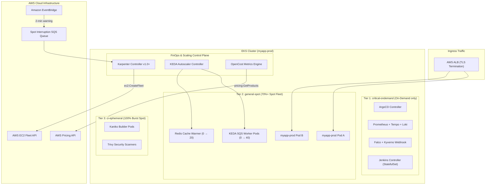
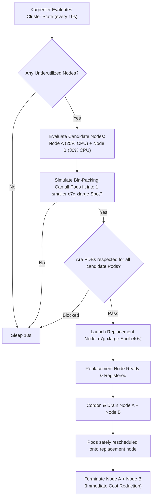
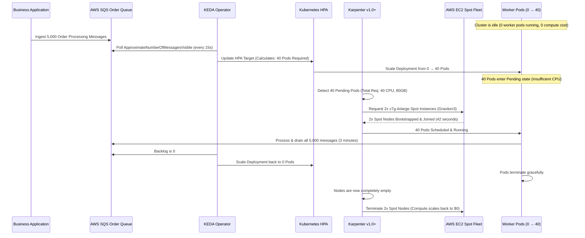

# Project 6: FinOps & Karpenter Diagrams

> Architecture and sequence diagrams rendered in Mermaid format.

---

## 1. Overall Cluster Topology & NodePool Segregation

---

## 2. Dynamic Node Bin-Packing & Active Consolidation

---

## 3. End-to-End SQS Event-Driven Elasticity Loop

