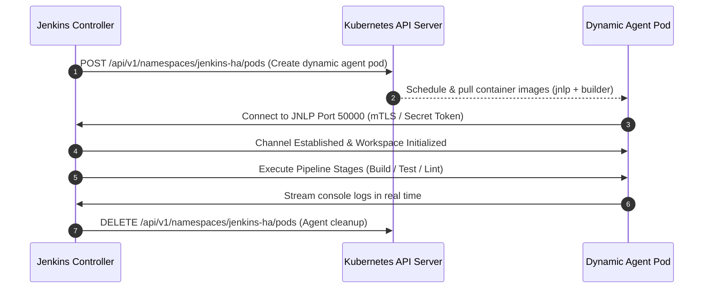

# Architecture Deep Dive & Failure Mode Analysis

> Technical breakdown of storage locking, failover choreography, Kubernetes Cloud Agent protocol, and zero-downtime upgrades.

---

## 1. Storage & File-Locking Internals

Jenkins stores state in a hierarchical directory structure on the filesystem:

```
/var/jenkins_home/
├── config.xml              # Global Jenkins system configuration
├── credentials.xml         # Encrypted credentials store
├── secrets/                # Master cryptographic keys (master.key, hudson.util.Secret)
├── plugins/                # Installed plugin binaries (.jpi / .hpi)
├── nodes/                  # Agent configurations
└── jobs/                   # Pipeline definitions & build history
    └── my-pipeline/
        ├── config.xml
        └── builds/
            ├── 1/build.xml
            └── nextBuildNumber
```

### Why NFS / EFS with StatefulSet?
- **StatefulSet Guarantee:** Unlike a K8s Deployment, a `StatefulSet` with `replicas: 1` guarantees that **at most one Pod is scheduled with access to the volume at any given time**, preventing concurrent writer corruption.
- **PersistentVolume Detach/Attach:** When a node dies, the Kubernetes Storage Controller safely detaches the persistent volume and attaches it to the replacement node without manual intervention.

---

## 2. Dynamic Agent Lifecycle Protocol (JNLP / Inbound Agent)



1. **Zero Resource Waste:** Agent pods exist only for the duration of the pipeline execution.
2. **True Security Isolation:** Each build runs in an isolated container sandbox with a non-root user and restricted RBAC credentials.

---

## 3. High Availability Failover Chronology & RTO Breakdown

When a node failure occurs:

```
Time   Event                                                         Status
─────────────────────────────────────────────────────────────────────────────
T+0s   Underlying EC2/BareMetal node stops heartbeating               Node NotReady
T+10s  K8s Node Controller flags node as unreachable                  Eviction initiated
T+15s  StatefulSet Controller terminates old pod                      Pod Terminating
T+20s  Cloud Volume detached from failed node & attached to new node Volume Bound
T+25s  New Jenkins Controller pod scheduled on healthy worker node    Pod Initializing
T+35s  InitContainer verifies plugin manifest                         Plugins Verified
T+42s  Jenkins JVM starts, parses JCasC YAML, loads build records     HTTP 200 OK (/login)
─────────────────────────────────────────────────────────────────────────────
Total Recovery Time Objective (RTO): ~42 seconds. Data Loss (RPO): 0 seconds.
```

---

## 4. Disaster Recovery (DR) Strategy: Cold vs Warm vs Hot

| DR Level | Mechanism | RTO | RPO | Cost |
| :--- | :--- | :---: | :---: | :---: |
| **Hot (Active-Active)** | CloudBees Operations Center + High-availability multi-region | < 10s | < 1s | $$$$$ ($150k+/yr) |
| **Warm Auto-Healing (This Project)** | K8s StatefulSet + Multi-AZ Storage + ThinBackup CronJob | **< 45s** | **~ 0s** | **$ (Infrastructure only)** |
| **Cold (Manual VM snapshot)** | Restore VM snapshot from overnight tape/S3 | 4–8 hours | Up to 24h | $ |
