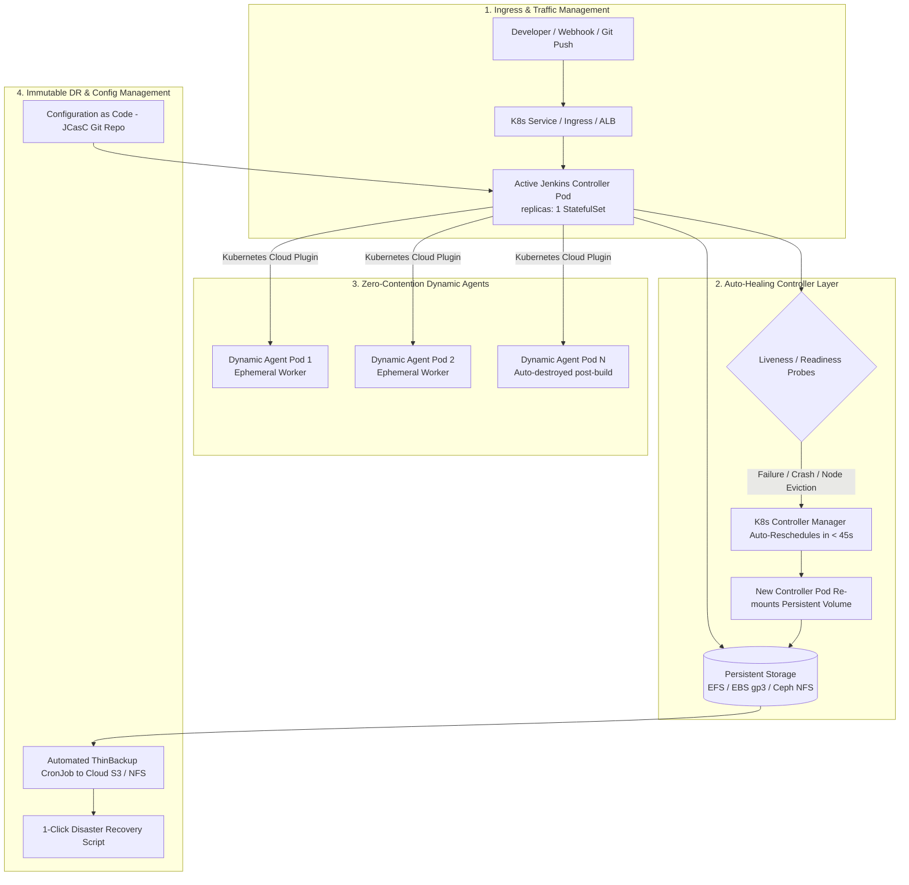

# 🔒 Production Jenkins High Availability (HA) & Disaster Recovery on Kubernetes

An enterprise-grade, production-ready architecture establishing **Zero-Downtime, Fault-Tolerant, and Auto-Healing Jenkins** on Kubernetes.

---

## 🎯 1. What is the Problem with Standard Jenkins?

By design, open-source Jenkins is a **single-controller architecture**. In a traditional setup:
1. **Single Point of Failure (SPOF):** If the Jenkins master VM or container dies, all CI/CD pipelines halt.
2. **Controller Overload:** Running builds directly on the master causes Out-Of-Memory (`OOMKilled`) crashes and CPU starvation.
3. **Storage Corruption Risk:** Running two active master instances concurrently on the same `$JENKINS_HOME` directory results in fatal file-locking conflicts and database corruption.
4. **Snowflake Configuration:** Manual UI configurations make disaster recovery slow and error-prone.

---

## 🏗️ 2. The Production Jenkins HA Architecture

This project implements the industry-standard **Active Controller Auto-Healing + 100% Dynamic Ephemeral Kubernetes Agents + JCasC + Automated DR** pattern:



---

## 🛡️ 3. The 4 Pillars of Jenkins High Availability

| Pillar | Architecture Pattern | Production Benefit |
| :--- | :--- | :--- |
| **1. Controller Auto-Healing** | K8s `StatefulSet` with aggressive liveness/readiness probes, single-writer lock on persistent storage, and automatic node rescheduling. | Recovery Time Objective (**RTO < 45s**) with zero job history loss. |
| **2. Ephemeral Dynamic Agents** | Controller has `numExecutors: 0`. 100% of pipeline builds run in dynamically provisioned Kubernetes agent pods that scale from `0 -> 100+`. | Eliminates controller CPU/Memory contention; agent crashes never impact master. |
| **3. Configuration as Code (JCasC)** | Entire controller configuration (security, credentials, agent pod templates, Prometheus metrics) is declared in version-controlled YAML. | Zero configuration drift; master can be recreated from scratch in 2 minutes. |
| **4. Disaster Recovery (DR)** | Automated `CronJob` takes periodic snapshots of `$JENKINS_HOME` core metadata (`config.xml`, `secrets/`, `jobs/`) with 1-click restore. | Recovery Point Objective (**RPO < 4 hours**) against storage/cluster failures. |

---

## 📁 4. Repository Structure

```
jenkins-high-availability/
├── README.md                          # Complete Architecture & Production Guide
├── TESTING-GUIDE.md                   # Step-by-step verification and chaos testing manual
├── kubernetes/
│   ├── namespace.yaml                 # Dedicated baseline namespace
│   ├── rbac.yaml                      # RBAC for agent pod provisioning
│   ├── configmap-jcasc.yaml           # JCasC ConfigMap
│   ├── pvc.yaml                       # Persistent Volume Claim for $JENKINS_HOME
│   ├── statefulset.yaml               # Hardened Controller StatefulSet with Probes
│   └── service.yaml                   # HTTP & JNLP Services
├── jcasc/
│   ├── jenkins.yaml                   # Declarative JCasC configuration
│   └── plugins.txt                    # Pinned production plugins
├── backup-dr/
│   ├── cronjob-backup.yaml            # Automated ThinBackup CronJob
│   └── restore-script.sh              # 1-Click Disaster Recovery restore tool
├── pipelines/
│   └── Jenkinsfile                    # HA Distributed Dynamic Agent Pipeline Demo
└── scripts/
    ├── deploy-and-test.sh             # 1-Click full stack deployment script
    └── simulate-node-failure.sh       # Chaos test script to measure failover RTO
```

---

## 🚀 5. Quick Start & Failover Testing

### 1. Deploy the Complete Stack
```bash
cd cka/practical/jenkins-high-availability
chmod +x scripts/*.sh backup-dr/*.sh

# Deploy full HA stack to your Kubernetes cluster
./scripts/deploy-and-test.sh
```

### 2. Simulate Node Crash & Measure RTO
```bash
./scripts/simulate-node-failure.sh
```

### 3. Test Disaster Recovery Restore
```bash
./backup-dr/restore-script.sh /var/jenkins_home/backups/<backup-folder>/jenkins_core_config.tar.gz
```
