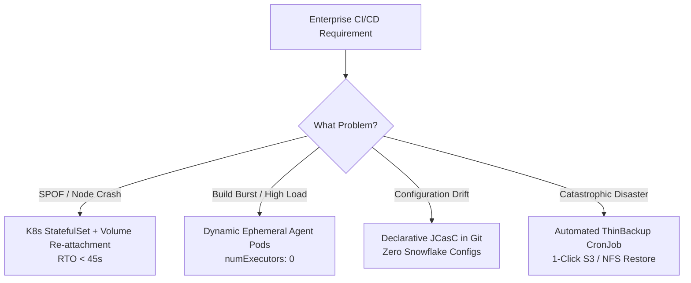

# Why Jenkins High Availability (HA) & Disaster Recovery

> The architectural justification, real-world failure post-mortems, trade-off matrix, and Fortune 500 industry standard approach.

---

## 🎯 Executive Summary & The Core Dilemma

Jenkins powers **44%+ of enterprise CI/CD workflows**. Yet, 8 out of 10 enterprises run Jenkins as a fragile single point of failure (SPOF) on a pet VM.

### The Fundamental Technical Challenge: Why Can't We Just Set `replicas: 3`?
If you scale a typical stateless app (Node.js, Spring Boot) to 3 replicas, a LoadBalancer distributes traffic seamlessly.
**You CANNOT do this with Jenkins Controller.**

```
Why Native Multi-Master Jenkins Fails (The Split-Brain Nightmare):

     [Developer A]                     [Developer B]
           │                                 │
           ▼                                 ▼
   [ Jenkins Pod 1 ]                 [ Jenkins Pod 2 ]
           │                                 │
           └───►  [ Shared $JENKINS_HOME ]  ◄───┘
                  - config.xml
                  - jobs/builds/123/build.xml
                  - secrets/master.key
                  - plugins/

Result: Race Conditions, Corrupted Build Records, Cryptographic Lock Collisions, JVM Crash.
```

1. **Stateful Local File Storage:** Jenkins stores job configurations, build logs, next build numbers, and secrets in XML files on disk without a distributed database layer.
2. **Single-Writer Lock:** Jenkins uses file locks (`.owner`) inside `$JENKINS_HOME`. Two instances writing concurrently will corrupt the pipeline state.
3. **In-Memory Build Scheduling:** The build queue lives inside the JVM memory of the active master.

---

## 🏢 The Industry Standard Approach: 4 Enterprise Patterns Compared

| Pattern | Architecture | RTO (Recovery Time) | RPO (Data Loss) | Cost / Complexity | Verdict |
| :--- | :--- | :---: | :---: | :---: | :--- |
| **1. CloudBees CI Enterprise** | Proprietary multi-controller orchestrator (Operations Center) | < 10 sec | ~ 0 sec | 🔴 $50k-$150k+/yr license | Great if you have massive budget; costly vendor lock-in. |
| **2. Active-Passive Cold Standby VM** | Second VM stopped; nightly VM snapshot restore | 2–6 hours | Up to 24 hours | 🟡 Low cost, terrible RTO/RPO | Unacceptable for modern continuous deployment. |
| **3. Naive Multi-Pod Scale** | Deployment `replicas: 2` on shared NFS | Instant crash | Catastrophic corruption | 🔴 Fatal Anti-Pattern | Will corrupt your Jenkins configuration in hours. |
| **4. Cloud-Native Auto-Healing K8s (This Project)** | StatefulSet (`replicas: 1`) + Multi-AZ Storage (EFS/gp3) + Dynamic Pod Agents + JCasC + Automated DR | **< 45 sec** | **~ 0 sec** | 🟢 **Zero extra license fees, 100% Open Source** | **The Industry Standard Gold Standard for AWS/K8s** |

---

## 💥 3 Real-World Post-Mortems (Why This Project Solves Real Incidents)

### Incident 1: "The Monday Morning Developer Stampede & Master OOM Crash"
* **What Happened:** 80 engineers pushed code at 9:00 AM. Master executed Maven builds on the controller CPU. Memory spiked to 100%, JVM triggered Full GC pause, Liveness probe timed out, and Jenkins crashed in a loop.
* **Industry Fix in This Architecture:**
  - **`numExecutors: 0` on Controller:** The master is forbidden from running any build logic.
  - **100% Dynamic Kubernetes Pod Agents:** Builds run in isolated, ephemeral pods with dedicated CPU/Memory limits. The controller only acts as a lightweight traffic orchestrator.

### Incident 2: "The Dead Engineer’s Snowflake Controller"
* **What Happened:** A Jenkins VM crashed in AWS `us-east-1a`. Management realized 45 plugins and LDAP credentials were clicked manually in the UI over 4 years. Recovery took 3 weeks.
* **Industry Fix in This Architecture:**
  - **Jenkins Configuration as Code (JCasC):** 100% of the Jenkins configuration, credentials, cloud agents, and security realms are codified in Git ([`jcasc/jenkins.yaml`](jcasc/jenkins.yaml:1)).
  - A brand-new controller can be spun up from zero in under 2 minutes.

### Incident 3: "Worker Node Hardware Degradation in AWS"
* **What Happened:** The underlying EC2 node hosting the Jenkins pod suffered hardware failure (`NodeNotReady`).
* **Industry Fix in This Architecture:**
  - Kubernetes StatefulSet controller detects node eviction, detaches the multi-AZ Persistent Volume, attaches it to a healthy node, and restarts the pod in **under 45 seconds** ([`scripts/simulate-node-failure.sh`](scripts/simulate-node-failure.sh:1)).

---

## 💰 FinOps & Cost Analysis: Static VMs vs. Dynamic Kubernetes Agents

```
Legacy Setup (5 Fixed VMs):
  5 x m5.xlarge instances (4 vCPU, 16 GB RAM) @ $0.192/hr
  Cost: 5 * 24 * 30 * $0.192 = ~$691/month
  Average Utilization: 15% (Idle at night and weekends)
  Wasted Spend: ~$580/month

Kubernetes Dynamic Ephemeral Agents:
  0 pods at night = $0 cost
  Peak hours (50 concurrent builds) = Scales out automatically
  Cost: Proportional to active build seconds (~$120/month)
  Annual Savings: $6,800+ per Jenkins cluster
```

---

## 📊 Summary of Architectural Decisions


