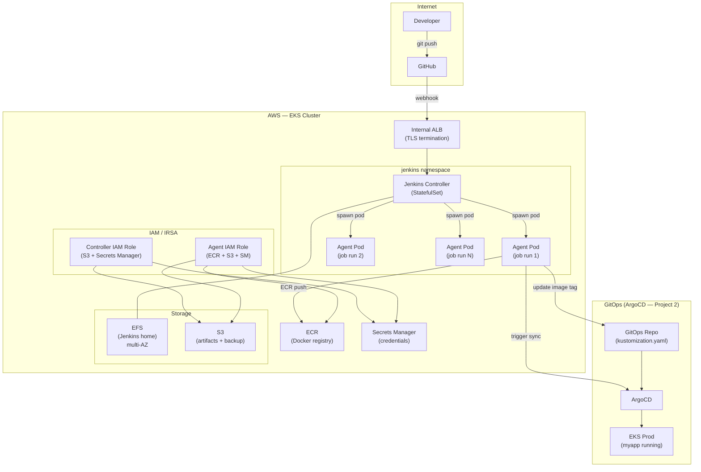
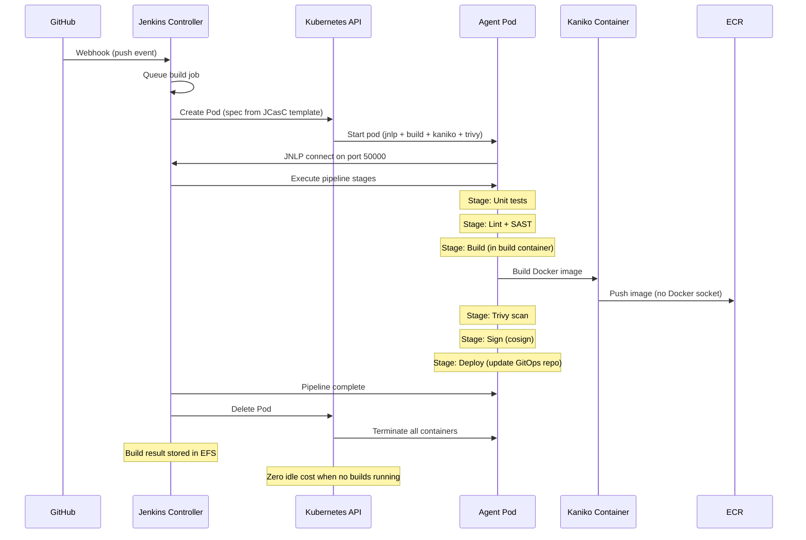
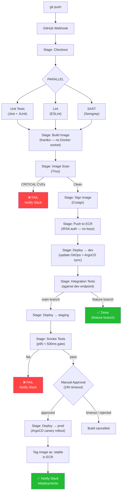
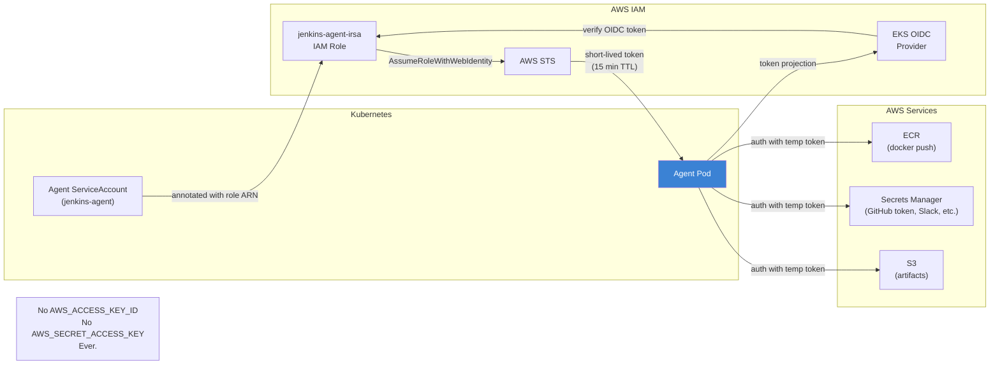
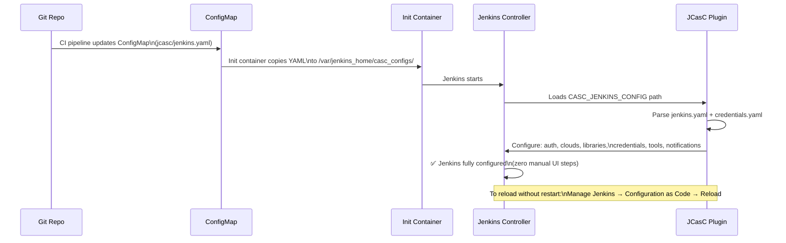
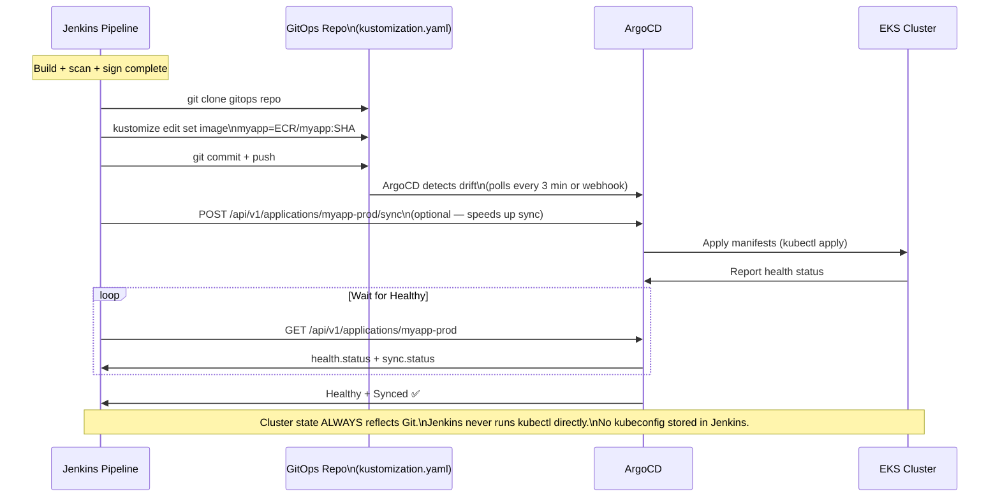
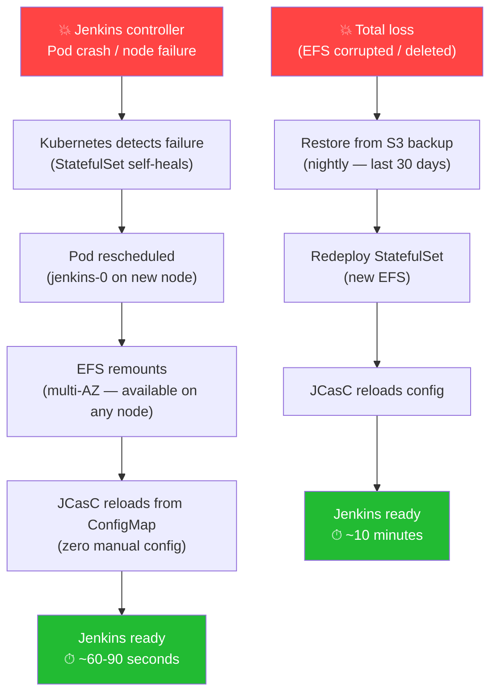

# Jenkins Production — Diagrams

> All diagrams use Mermaid — render natively in GitHub, GitLab, and Notion.

---

## Diagram 1 — Overall Architecture

---

## Diagram 2 — Agent Pod Lifecycle

---

## Diagram 3 — Full CI/CD Pipeline Flow

---

## Diagram 4 — Credential Flow (No Static Keys)

---

## Diagram 5 — JCasC Configuration Loading

---

## Diagram 6 — Jenkins ↔ ArgoCD GitOps Contract

---

## Diagram 7 — Disaster Recovery

