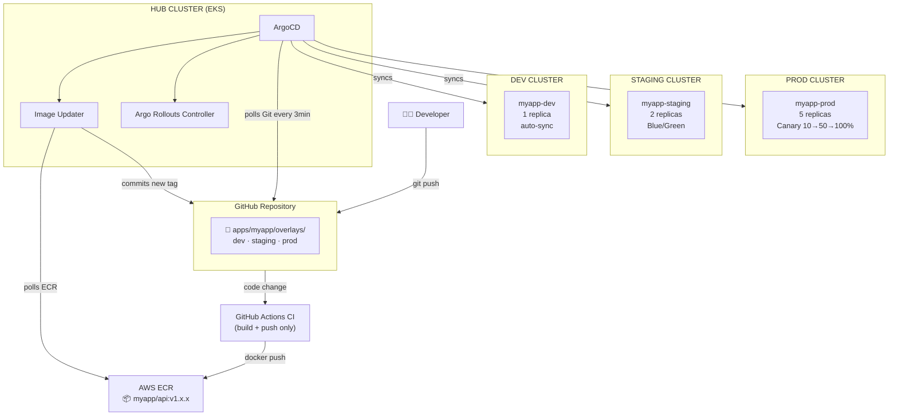
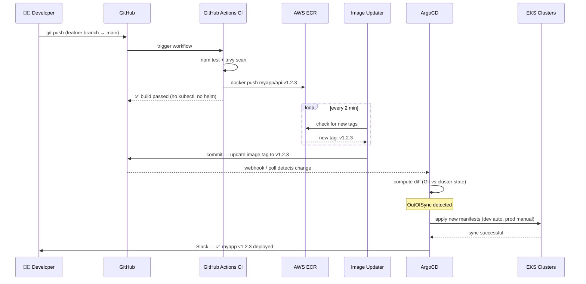
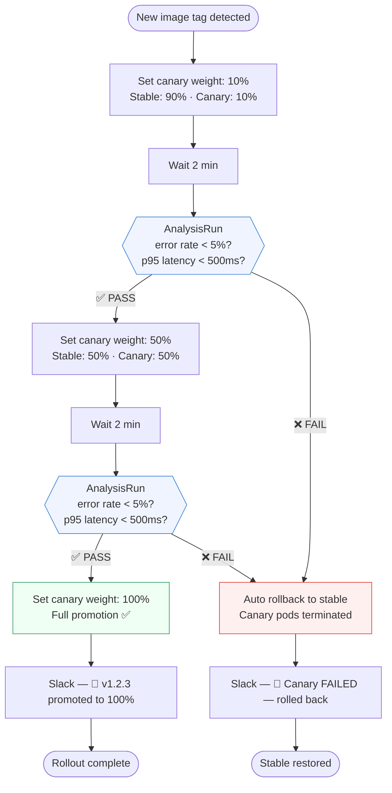
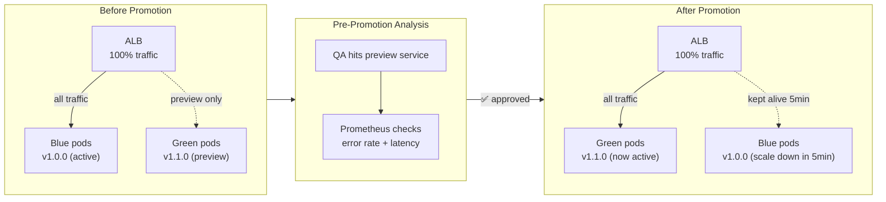
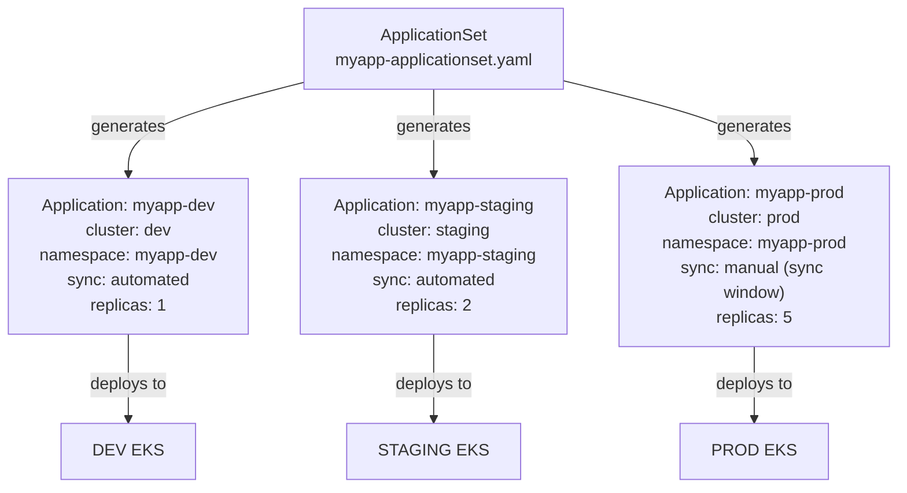
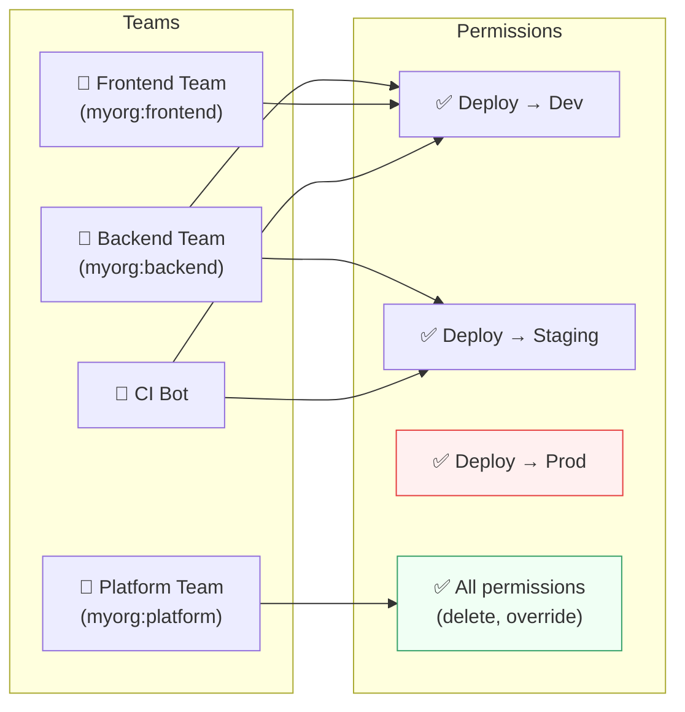

# Project 2 — Architecture Diagrams (Mermaid)

---

## 1. Hub-Spoke Cluster Model

---

## 2. Full GitOps Loop (end to end)

---

## 3. Canary Rollout Flow (Prod)

---

## 4. Blue/Green Rollout Flow (Staging)

---

## 5. ApplicationSet — One YAML → 3 Clusters

---

## 6. RBAC — Who Can Deploy What

---

## 7. Sync Windows — When Can You Deploy to Prod?

```mermaid
gantt
    title Prod Sync Windows (Mon–Fri only)
    dateFormat HH:mm
    axisFormat %H:%M

    section Blocked
    No deploys allowed     :crit, 00:00, 09:00
    No deploys allowed     :crit, 17:00, 24:00

    section Allowed
    Prod deploy window     :active, 09:00, 17:00
```

