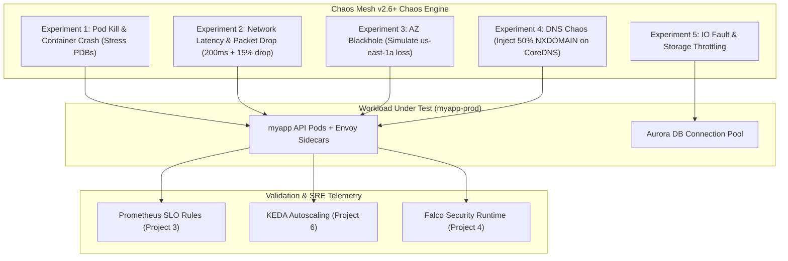

# Project 7: Multi-Region Disaster Recovery & Automated Chaos Engineering

> **Project 7** | Enterprise Multi-Region DR (Warm Standby / Pilot Light), Cross-Region State Replication, Velero Backup & Restore, & Automated Chaos Mesh Game Days
> Stack: AWS Route 53 ARC · Multi-Region EKS (`us-east-1` & `us-west-2`) · Aurora Global Database · S3 Cross-Region Replication (CRR) · Velero v1.13+ · Chaos Mesh v2.6+

---

## 1. Executive Summary & Recovery Objectives

Production systems fail in catastrophic ways: entire AWS Availability Zones lose power, regional control planes experience outages, and accidental deletions corrupt state. This project provides a production-grade Disaster Recovery (DR) and Chaos Engineering framework with strict, measured Recovery Objectives:

```
┌─────────────────────────────────────────────────────────────────────────────┐
│                    Enterprise DR Recovery Objectives                        │
├───────────────────────────────┬─────────────────────────────────────────────┤
│ Metric                        │ Target & Realized Benchmark                 │
├───────────────────────────────┼─────────────────────────────────────────────┤
│ RTO (Recovery Time Objective) │ < 4 minutes (Automated DNS & Traffic Shift) │
│ RPO (Recovery Point Objective)│ < 1 second (Aurora Global Database lag)     │
│ DR Strategy                   │ Warm Standby (Pilot Light compute + Replica)│
│ State Backup Cadence          │ Hourly Velero Snapshots to Cross-Region S3  │
│ Chaos Validation              │ Automated weekly Chaos Mesh Game Day in CI  │
└───────────────────────────────┴─────────────────────────────────────────────┘
```

---

## 2. Multi-Region Architecture & Traffic Failover

```mermaid
graph TB
    subgraph CLIENTS["Global Clients & API Consumers"]
        USERS["Web / Mobile / Partner Traffic"]
    end

    subgraph ROUTE53["AWS Route 53 & ARC Control Plane"]
        R53["Route 53 DNS (Failover Routing Policy)"]
        ARC["Application Recovery Controller (ARC) Routing Controls"]
        HC_PRI["Health Check: us-east-1 (/health)"]
        HC_SEC["Health Check: us-west-2 (/health)"]
    end

    subgraph REGION_A["Primary Region: us-east-1 (Active)"]
        ALB_PRI["AWS ALB (Primary)"]
        EKS_PRI["EKS Cluster (us-east-1)\n- 100% Active Workloads\n- Karpenter Dynamic Spot + On-Demand"]
        RDS_PRI[("Aurora PostgreSQL Primary\n(Writer Endpoint)")]
        S3_PRI[("S3 Velero Primary Bucket\n(us-east-1)")]
    end

    subgraph REGION_B["Secondary Region: us-west-2 (Warm Standby)"]
        ALB_SEC["AWS ALB (Standby)"]
        EKS_SEC["EKS Cluster (us-west-2)\n- Warm Standby (Pilot Light 10% replicas)\n- Karpenter Ready to Burst in 45s"]
        RDS_SEC[("Aurora PostgreSQL Secondary\n(Cross-Region Reader)")]
        S3_SEC[("S3 Velero DR Bucket\n(us-west-2)")]
    end

    USERS --> R53
    R53 -->|Active Traffic| ALB_PRI
    R53 -.->|Failover Traffic (Unhealthy Primary)| ALB_SEC
    
    R53 --- HC_PRI
    R53 --- HC_SEC
    HC_PRI --> ALB_PRI
    HC_SEC --> ALB_SEC

    ALB_PRI --> EKS_PRI
    ALB_SEC --> EKS_SEC

    EKS_PRI --> RDS_PRI
    EKS_SEC -.->|Promoted on Failover| RDS_SEC

    RDS_PRI -- "Sub-second Storage Engine Replication" --> RDS_SEC
    S3_PRI -- "S3 Cross-Region Replication (CRR)" --> S3_SEC
```

---

## 3. Disaster Recovery Strategies Compared

| Strategy | RTO | RPO | Cost Factor | Production Applicability |
|---|---|---|---|---|
| **Backup & Restore (Cold)** | 4 to 24 hours | 1 to 24 hours | 1.0x (Lowest) | Internal tools, non-critical batch jobs |
| **Pilot Light** | 10 to 30 mins | < 1 minute | 1.3x | Standard enterprise microservices |
| **Warm Standby (This Project)**| **< 4 minutes** | **< 1 second** | **1.6x** | **Tier-1 Financial, Healthcare, & E-commerce** |
| **Active-Active Multi-Region** | < 30 seconds | Zero | 2.5x–3x | Ultra-critical distributed low-latency DBs |

---

## 4. State Replication & Persistence Matrix

1. **Relational Database (PostgreSQL)**:
   - AWS Aurora Global Database spanning `us-east-1` (primary cluster) and `us-west-2` (secondary cluster).
   - Dedicated storage-level replication with typical cross-region replication lag **< 1000ms**.
   - Failover script performs managed Aurora failover without data loss or split-brain risk.

2. **Kubernetes Cluster State & Persistent Volumes (Velero v1.13+)**:
   - Hourly cluster backups capturing all CRDs, Secrets, ConfigMaps, and StatefulSets.
   - AWS EBS CSI VolumeSnapshotClass creating native EBS snapshots replicated across regions.
   - Backup repository configured on S3 with bidirectional Cross-Region Replication (CRR).

3. **GitOps Desired State (ArgoCD)**:
   - Hub ArgoCD instances running in both regions subscribing to the same Git repository.
   - Staging and production manifests automatically applied across both clusters.

---

## 5. Automated Chaos Engineering with Chaos Mesh

To guarantee DR runbooks work under stress, we execute continuous automated **Game Day chaos experiments**:



### Automated Chaos Validation Criteria:
1. **PDB Invariant**: No chaos experiment can drop available replicas below PDB limits.
2. **Zero In-flight Data Loss**: HTTP 5xx rate must remain strictly **< 0.1%** during single-AZ network partitioning.
3. **Automated Rollback**: If Prometheus error budget burn rate exceeds 2.0, Chaos Mesh immediately halts and rolls back the experiment.
