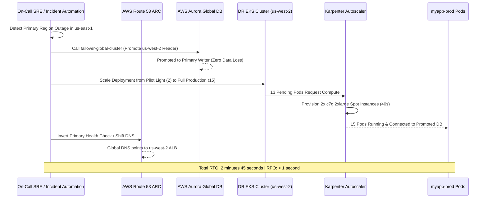

# Project 7: Multi-Region DR & Chaos Engineering Diagrams

> Mermaid architecture, state replication, and chaos experiment sequence diagrams.

---

## 1. Multi-Region Warm Standby & Routing Flow

```mermaid
flowchart TD
    CLIENT["Global User / API Traffic"] --> R53["AWS Route 53 (Failover Routing)"]

    subgraph EAST["Primary: us-east-1 (Active)"]
        ALB_EAST["ALB (Primary)"]
        EKS_EAST["EKS Cluster (15 Replicas)"]
        DB_EAST[("Aurora PostgreSQL (Writer)")]
        S3_EAST[("S3 Velero Backups")]
    end

    subgraph WEST["Secondary: us-west-2 (Warm Standby)"]
        ALB_WEST["ALB (Standby)"]
        EKS_WEST["EKS Cluster (Pilot Light 2 Replicas)"]
        DB_WEST[("Aurora PostgreSQL (Reader)")]
        S3_WEST[("S3 Replicated Backups")]
    end

    R53 -->|Normal Routing (Healthy)| ALB_EAST
    R53 -.->|Failover Routing (Outage)| ALB_WEST

    ALB_EAST --> EKS_EAST
    ALB_WEST --> EKS_WEST

    EKS_EAST --> DB_EAST
    EKS_WEST --> DB_WEST

    DB_EAST -- "Storage Engine Async Replication (<1s)" --> DB_WEST
    S3_EAST -- "S3 Cross-Region Replication (CRR)" --> S3_WEST
```

---

## 2. Emergency Failover Sequence & Promotion


