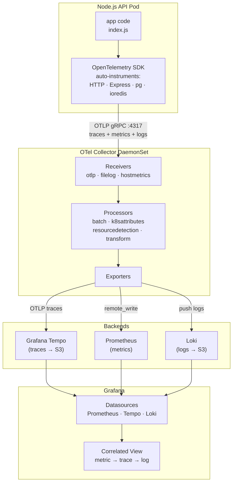
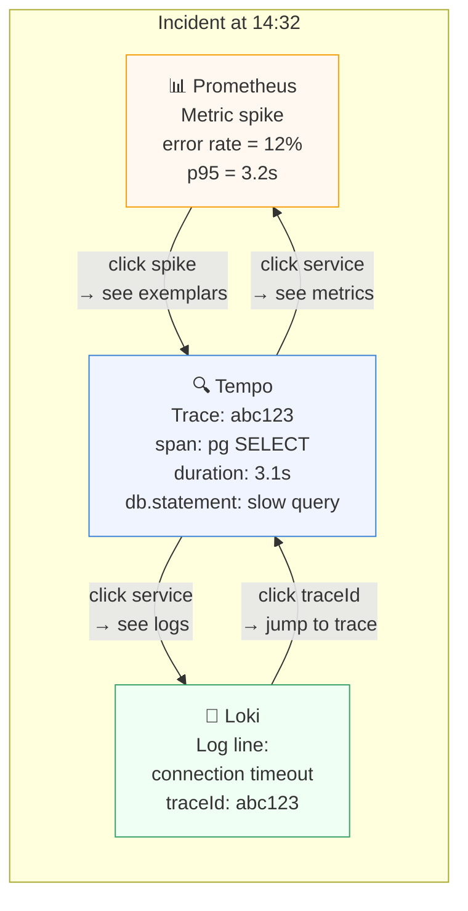
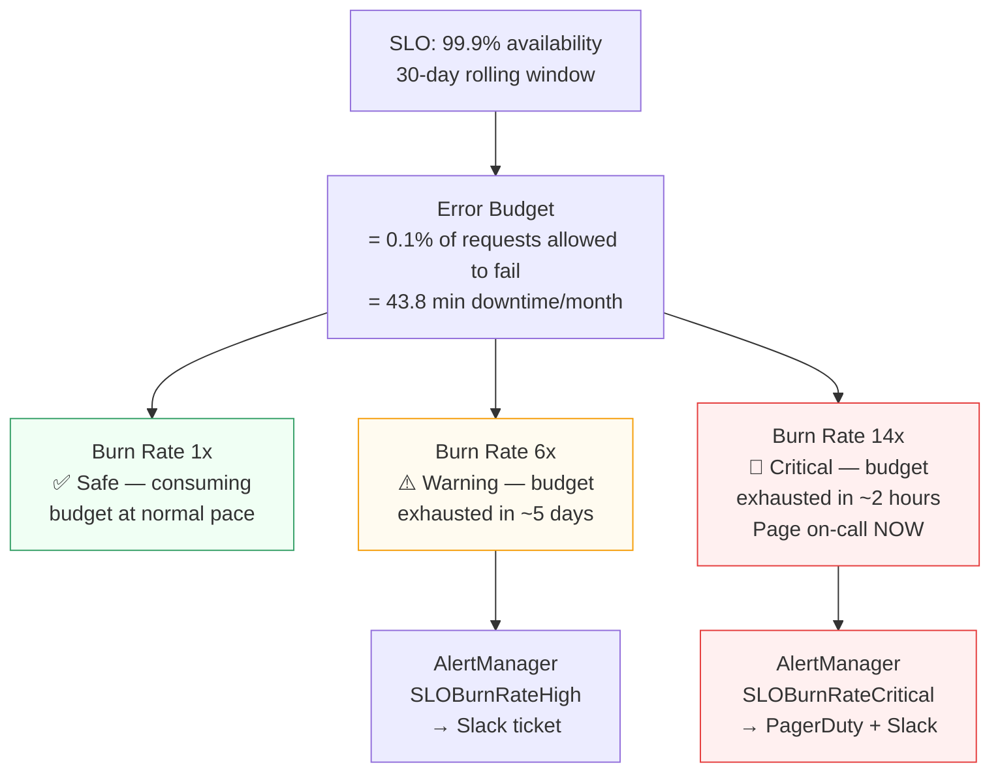
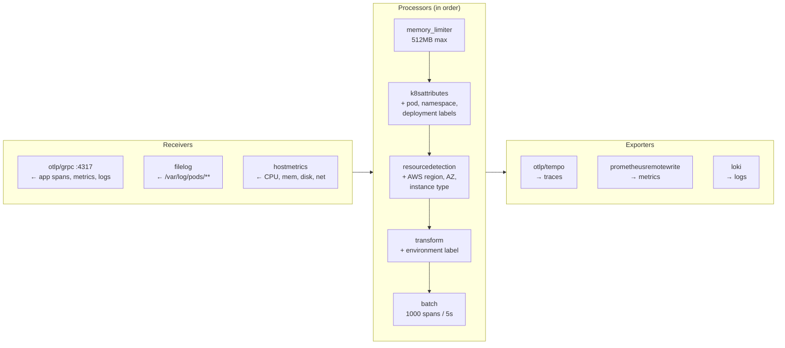
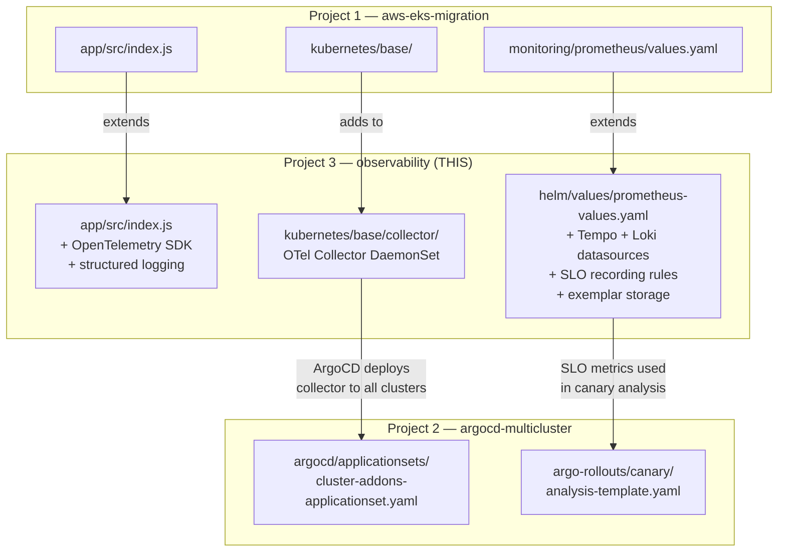
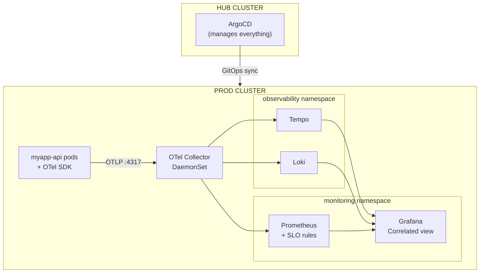

# Project 3 — Observability Architecture Diagrams

---

## 1. Full Observability Pipeline

---

## 2. Distributed Trace — One Request Waterfall

```mermaid
gantt
    title Trace: GET /api/items (TraceID: abc123)
    dateFormat x
    axisFormat %L ms

    section HTTP Layer
    express route handler     :0, 12

    section Cache
    redis GET items (miss)    :1, 2

    section Database
    pg connect                :3, 1
    pg query SELECT items     :4, 8

    section Cache Write
    redis SET items EX 60     :12, 1
```

---

## 3. Three Pillars Correlated in Grafana

---

## 4. SLO Error Budget Model

---

## 5. OpenTelemetry Collector Pipeline Detail

---

## 6. Links to Project 1 and Project 2

---

## 7. Deployment Topology (all 3 projects combined)

