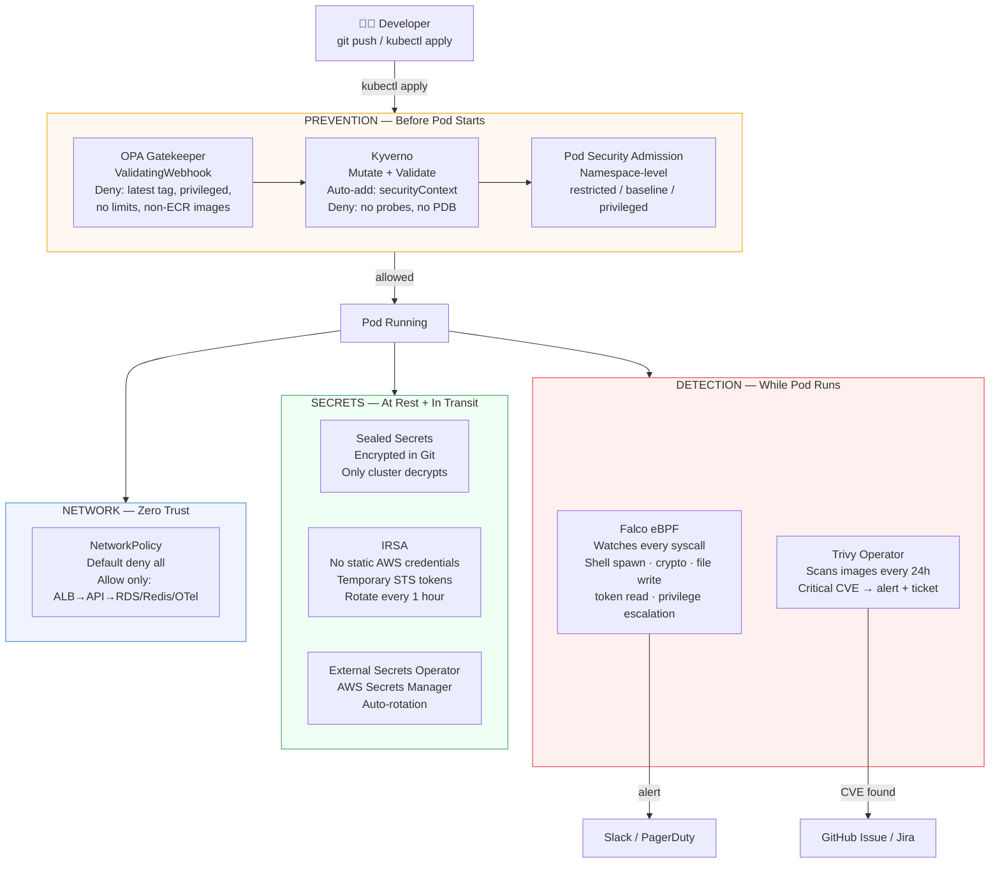
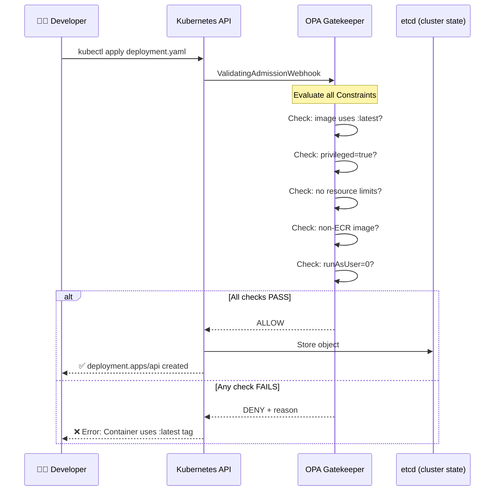
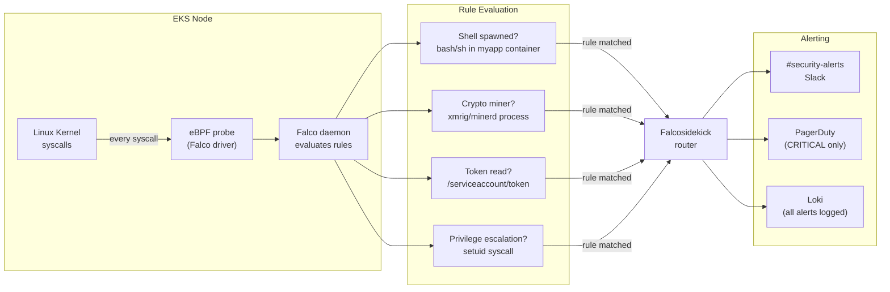
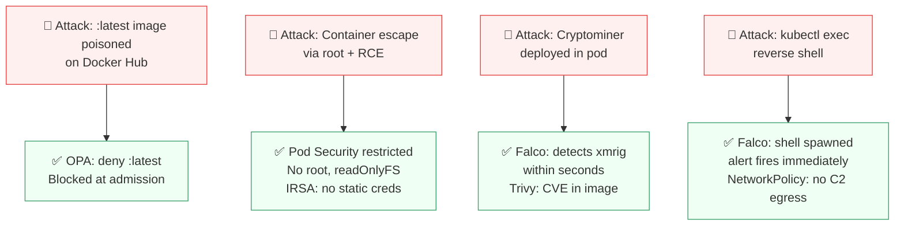
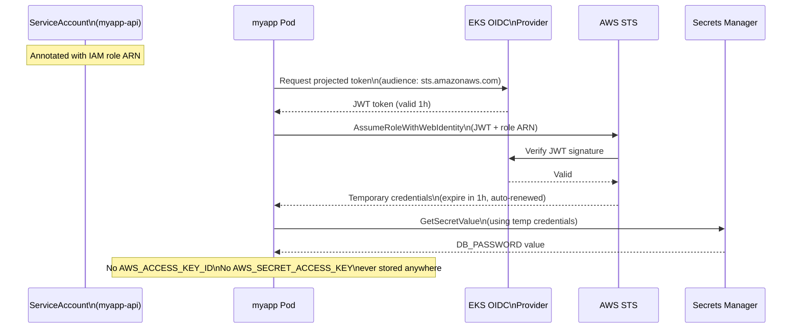
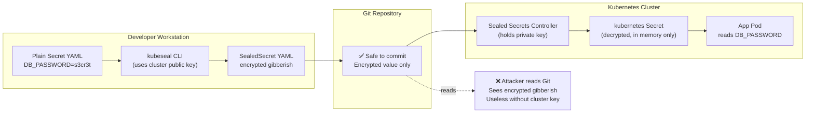
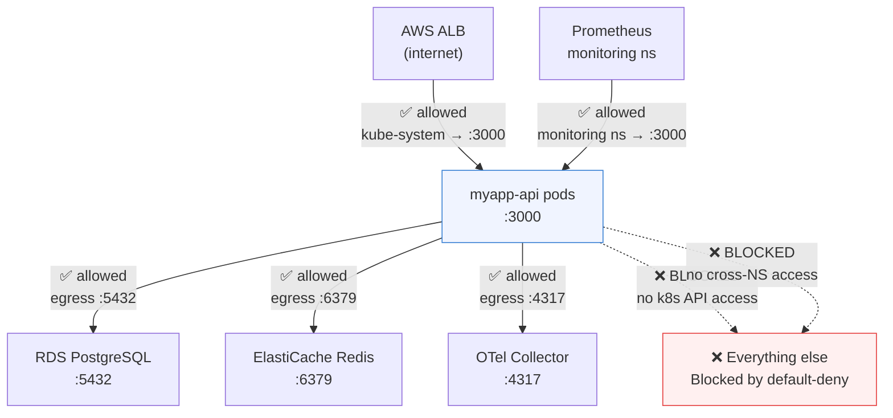

# Project 4 — Security Architecture Diagrams

---

## 1. Defence-in-Depth — All Security Layers

---

## 2. OPA Gatekeeper — Admission Flow

---

## 3. Falco Runtime Detection Flow

---

## 4. Attack Chain vs Defence

---

## 5. IRSA — How Pods Get AWS Credentials Without Static Keys

---

## 6. Sealed Secrets — GitOps-Safe Secret Management

---

## 7. Zero-Trust NetworkPolicy

