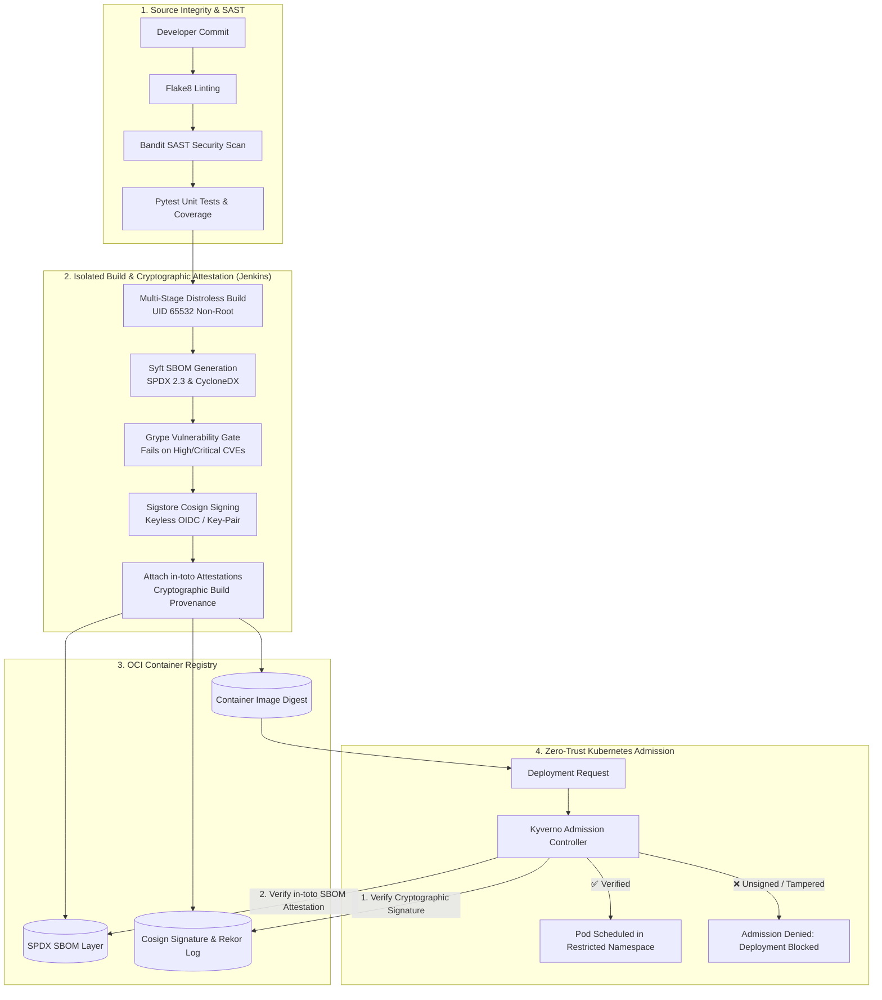

# 🔒 Supply Chain Security & SLSA Level 3 DevSecOps Platform

An enterprise-grade **DevSecOps & Software Supply Chain Security** implementation for Python microservices running on Kubernetes.

---

## 🎯 1. What is the Purpose of this Project? Is it DevSecOps?

**Yes, this is an end-to-end DevSecOps and Software Supply Chain Security implementation.**

The objective of this architecture is to solve the **Software Supply Chain Security Problem** (mandated by US Executive Order 14028, NIST SSDF, and SLSA Level 3 framework). It ensures that no code reaches a production Kubernetes cluster unless:

1. **Source & Build Integrity (SLSA L3):** The build is executed in an isolated, tamper-proof environment generating verifiable provenance metadata.
2. **Component Transparency (SBOM Lifecycle):** **Syft** scans all dependencies, binaries, and OS packages to produce a structured Software Bill of Materials (SPDX / CycloneDX format).
3. **Automated Security Gating:** **Grype** and SAST engines inspect dependencies against known CVE databases and fail builds before packaging.
4. **Non-repudiation (Cryptographic Signing):** **Sigstore Cosign** performs keyless OIDC image signing (via Fulcio & Rekor transparency logs).
5. **Zero-Trust Policy Enforcement (Admission Control):** **Kyverno** or Open Policy Agent (OPA Gatekeeper) inside Kubernetes validates signatures and attestation before allowing pods to schedule.

---

## 🏢 2. Where Do We Need to Use It? (Target Use Cases)

| Industry / Environment | Why It Is Mandatory |
| :--- | :--- |
| **US Federal Agencies & Government Contractors** | Required by **White House Executive Order 14028** and **NIST SP 800-218** (SSDF) requiring attestation of software provenance and machine-readable SBOMs for all vendors. |
| **Banking, Financial Services & FinTech** | Meets strict **PCI-DSS 4.0**, **SOC 2 Type II**, and **FFIEC** compliance audits requiring tamper-proof build pipelines and non-repudiation of production deployments. |
| **Healthcare & Life Sciences** | Satisfies **HIPAA / FDA Software Cybersecurity Guidance** ensuring medical and patient-facing microservices are built with verified dependency lineage. |
| **Enterprise SaaS & Multi-Tenant Kubernetes** | Enforces zero-trust cluster admission control so developer teams or automated deployments cannot accidentally push unvetted or untrusted images into production namespaces. |

---

## 🧪 3. Can You Do Simple "Hello World" App Testing Using Jenkins?

**Yes, absolutely.** You do not need complex code to test this. A minimal "Hello World" app (Node.js, Go, Python, or Java) is the standard vehicle to validate every stage of the pipeline.

### Minimal Testing Workflow:
1. **Source Repository:** A simple `server.js` or `app.py` returning `"Hello World!"` + a lightweight `Dockerfile`.
2. **Jenkins Pipeline Execution:**
   - **Step 1:** Run unit tests (`npm test` or `pytest`).
   - **Step 2:** Build container: `docker build -t registry/hello-world:${BUILD_NUMBER} .`
   - **Step 3 (DevSecOps):** Run `syft` to create `sbom.spdx.json`.
   - **Step 4 (DevSecOps):** Run `grype sbom:sbom.spdx.json --fail-on high`.
   - **Step 5 (DevSecOps):** Sign the image via `cosign sign` and attach the SBOM using `cosign attest`.
   - **Step 6 (K8s Deploy):** Deploy to Kubernetes (`kubectl apply` or GitOps commit).
3. **Kyverno Verification Test:**
   - **If you deploy an unsigned/unscanned image:** Kyverno blocks the deployment with `Admission webhook "validate.kyverno.svc" denied the request`.
   - **If you deploy the Jenkins-signed image:** Kyverno permits the deployment and the pod runs.

---

## 🏭 4. Is it Production-Grade?

**Yes.** The architecture incorporates enterprise production patterns:

| Pillar | Production-Grade Capabilities |
| :--- | :--- |
| **Identity & Keys** | **Keyless OIDC Authentication:** Eliminates static, long-lived PGP keys or AWS/Docker private keys stored in CI variables. Uses short-lived JWT OIDC tokens verified against public transparency logs. |
| **Compliance Readiness** | **SLSA Level 3 & Executive Order 14028 Compliant:** Provides non-falsifiable in-toto build provenance and tamper-evident audit trails. |
| **Kubernetes Guardrails** | **Active Admission Control:** Kyverno policies run at the API Server level, preventing untrusted images from being run even if someone with cluster permissions attempts a manual `kubectl run`. |
| **Pipeline Reliability** | **Parallel quality checks** (SAST, Lint, Unit Tests), automatic rollback hooks, immutable OCI image digest pinning (`@sha256:...` instead of mutable `:latest` tags). |

---

## 🏗️ 5. Architecture & Trust Chain Flow



---

## 📁 6. Repository Structure

```
supply-chain-security-slsa/
├── Jenkinsfile                  # Enterprise CI/CD Pipeline integrating all DevSecOps stages
├── README.md                    # Purpose, Architecture, FAQs & Enterprise Use Cases
├── TESTING-GUIDE.md             # Complete step-by-step test execution guide
├── app/
│   ├── main.py                  # Production Python/Flask Microservice (Health & Status APIs)
│   ├── test_main.py             # Pytest Unit & Integration Tests
│   ├── requirements.txt         # Pinned Dependencies + Security Tools (Bandit, Flake8)
│   └── Dockerfile               # CIS-Hardened Multi-Stage Distroless Image
├── k8s/
│   ├── namespace.yaml           # Namespace with Restricted Pod Security Standard
│   ├── deployment.yaml          # Zero-Trust Deployment Manifest (Read-Only FS, Drop ALL)
│   └── service.yaml             # ClusterIP Service Definition
├── policies/
│   └── kyverno-slsa-policy.yaml # Admission Controller Policy (Requires Signature & SBOM)
└── scripts/
    ├── server-setup.sh          # One-shot tool installer for Linux servers (Ubuntu/Debian)
    ├── e2e-cluster-test.sh      # 8-stage automated live cluster test suite
    └── test-pipeline.sh         # Local offline simulation runner
```

---

## 🚀 7. Quick Start & Testing

### Option A: Automated E2E Cluster Testing (Dedicated Server)
```bash
# 1. Install prerequisites (Docker, Syft, Grype, Cosign, Kyverno CLI, Kind, Kubectl)
chmod +x scripts/*.sh
./scripts/server-setup.sh

# 2. Run the 8-stage live cluster test runner
./scripts/e2e-cluster-test.sh
```

### Option B: Running in Enterprise Jenkins
Point your Jenkins Multibranch or Pipeline Job to [`Jenkinsfile`](Jenkinsfile:1). The pipeline executes linting, unit tests, Bandit SAST, Syft SBOM generation, Grype CVE gating, Cosign signing, and Kubernetes deployment verification automatically.
